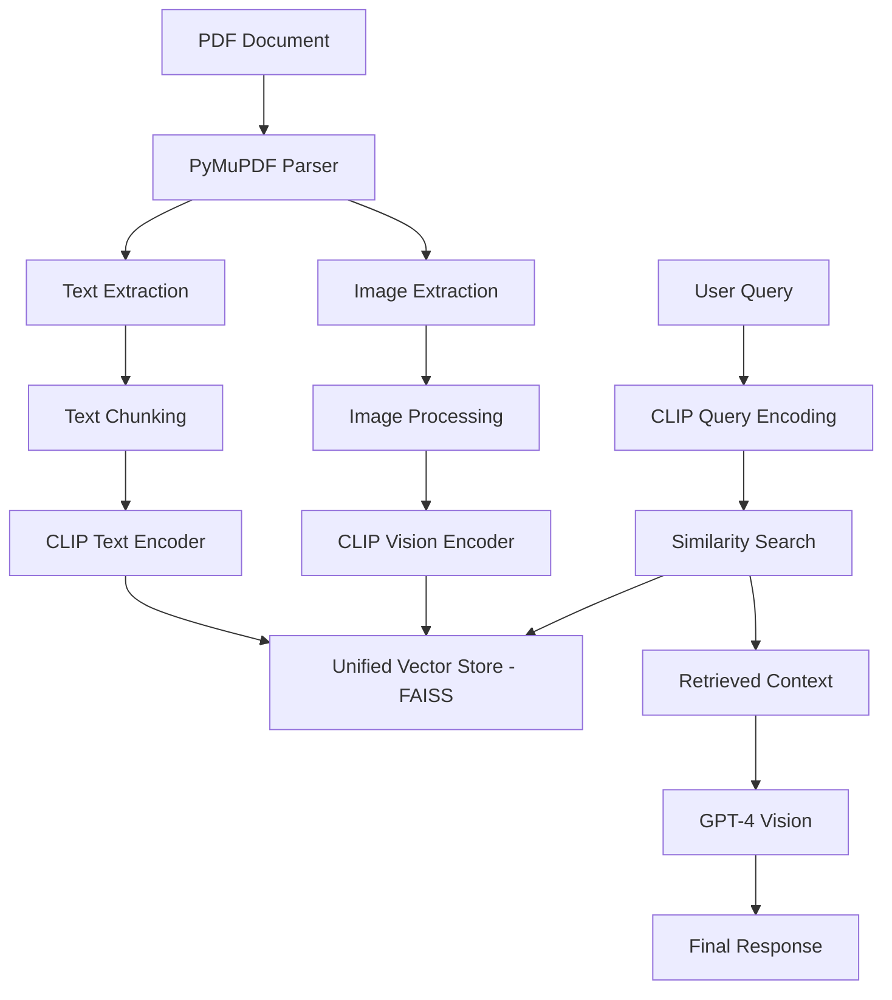

# 🔥 Multimodal RAG with CLIP: PDF Image-Text Embedding Engine

A cutting-edge **Retrieval-Augmented Generation (RAG)** system that processes both text and images from PDF documents using **OpenAI's CLIP model**. This project enables semantic search across multimodal content and generates comprehensive responses using GPT-4 Vision.

## 🌟 Features

- **🖼️ Multimodal Processing**: Extract and process both text and images from PDF documents
- **🧠 CLIP Embeddings**: Unified embedding space for images and text using OpenAI's CLIP model
- **🔍 Semantic Search**: Retrieve relevant content based on semantic similarity
- **💬 GPT-4 Vision Integration**: Generate responses using both text context and visual information
- **⚡ Efficient Storage**: FAISS vector database for fast similarity search
- **📊 Streamlit Interface**: User-friendly web interface for document upload and querying

## 🚀 Quick Start

### Prerequisites

- Python 3.8+
- OpenAI API key
- CUDA-compatible GPU (optional, for faster inference)

### Installation

1. **Clone the repository**
```bash
git clone https://github.com/your-username/agentic-langgraph.git
cd agentic-langgraph
```

2. **Install dependencies**
```bash
pip install -r requirements.txt
```

3. **Set up environment variables**
```bash
# Create a .env file in the root directory
echo "OPENAI_API_KEY=your_openai_api_key_here" > .env
```

### Usage

1. **Place your PDF file** in the project directory (default: `multimodal_sample.pdf`)

2. **Run the Jupyter notebook**
```bash
jupyter notebook multimodelopenai.ipynb
```

3. **Or use the Streamlit interface**
```bash
streamlit run app.py  # (if you have a Streamlit app)
```

## 🏗️ Architecture



## 🔧 Core Components

### 1. PDF Processing
```python
# Extract text and images from PDF pages
for page in document:
    text = page.get_text()  # Extract text
    images = page.get_images()  # Extract images
```

### 2. CLIP Embeddings
```python
def embed_text(text):
    """Generate CLIP embeddings for text"""
    inputs = clip_processor(text=text, return_tensors='pt')
    with torch.no_grad():
        features = clip_model.get_text_features(**inputs)
        return features / features.norm(dim=-1, keepdim=True)

def embed_image(image):
    """Generate CLIP embeddings for images"""
    inputs = clip_processor(images=image, return_tensors='pt')
    with torch.no_grad():
        features = clip_model.get_image_features(**inputs)
        return features / features.norm(dim=-1, keepdim=True)
```

### 3. Unified Retrieval
```python
def retrieve_multimodal(query, k=5):
    """Search for relevant text and images using CLIP embeddings"""
    query_embedding = embed_text(query)
    results = vector_store.similarity_search_by_vector(
        embedding=query_embedding, k=k
    )
    return results
```

## 📁 Project Structure

```
agentic-langgraph/
├── README.md                    # Project documentation
├── requirements.txt             # Python dependencies
├── multimodelopenai.ipynb      # Main Jupyter notebook
├── multimodal_sample.pdf       # Sample PDF for testing
├── .env                        # Environment variables (create this)
└── utils/                      # Utility functions (optional)
```

## 🛠️ Key Technologies

| Component | Technology | Purpose |
|-----------|------------|---------|
| **PDF Processing** | PyMuPDF (fitz) | Extract text and images from PDFs |
| **Multimodal Embeddings** | CLIP (openai/clip-vit-base-patch32) | Generate unified embeddings for text and images |
| **Vector Database** | FAISS | Fast similarity search and retrieval |
| **Language Model** | GPT-4 Vision (OpenAI) | Generate responses using multimodal context |
| **Framework** | LangChain | Orchestrate the RAG pipeline |
| **Interface** | Streamlit | Web-based user interface |

## 📊 Example Queries

- `"What does the chart on page 1 show about revenue trends?"`
- `"Summarize the main findings from the document"`
- `"What visual elements are present in the document?"`
- `"Compare the data shown in the images with the text descriptions"`

## 🎯 Use Cases

- **📋 Document Analysis**: Analyze business reports, research papers, and technical documents
- **🏥 Medical Records**: Process medical documents with charts, X-rays, and clinical notes
- **📚 Educational Content**: Create interactive learning experiences with textbooks and diagrams
- **📈 Financial Reports**: Analyze financial statements with charts and graphs
- **🏗️ Technical Manuals**: Process engineering documents with blueprints and specifications

## 🚀 Performance Optimizations

- **Batch Processing**: Process multiple documents simultaneously
- **Caching**: Cache embeddings to avoid recomputation
- **GPU Acceleration**: Use CUDA for faster CLIP inference
- **Async Processing**: Implement asynchronous document processing

## 🤝 Contributing

1. Fork the repository
2. Create a feature branch (`git checkout -b feature/amazing-feature`)
3. Commit your changes (`git commit -m 'Add amazing feature'`)
4. Push to the branch (`git push origin feature/amazing-feature`)
5. Open a Pull Request

## 📝 Future Enhancements

- [ ] Support for additional document formats (DOCX, PPTX)
- [ ] Integration with more vision-language models
- [ ] Advanced chunking strategies for better retrieval
- [ ] Multi-language support
- [ ] Real-time document processing
- [ ] Batch upload and processing capabilities

## ⚠️ Important Notes

- **API Costs**: Be mindful of OpenAI API usage costs, especially with GPT-4 Vision
- **File Size**: Large PDFs may require additional memory and processing time
- **Model Updates**: CLIP model weights are downloaded automatically on first run (~600MB)

## 📄 License

This project is licensed under the MIT License - see the [LICENSE](LICENSE) file for details.

## 🙏 Acknowledgments

- **OpenAI** for the CLIP model and GPT-4 Vision API
- **Hugging Face** for the transformers library and model hosting
- **LangChain** for the RAG framework
- **Krish Naik** for the educational content that inspired this project

---

**Made with ❤️ for the AI community**

*If you found this project helpful, please give it a ⭐ on GitHub!*
